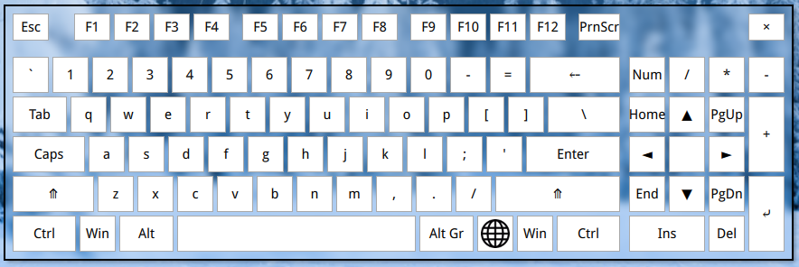

# QVKbd

A virtual keyboard written in C++ and QML.

## Dependecies

You need X11, Qt and QML packages installed.

## Building

    qmake
    make

## Installing

    sudo make install

## Usage

All settings can be accessed via context menu of the system tray icon.
There are also some command-line options:

* --show Run application in visible mode or show if already running
* --hide Run application in hidden mode or hide if already running
* --no-hide Disable hide button

## License

Program is distributed under terms of GNU GPLv3 license.
